# Assignment 1 - ReactJS app.

Name: Tony liujinhui

## Overview.

this is my assignment 1 and 2 for Web App development 2. In this i can get movies and different filter like popular, upcoming, toprated etc. i can also show the details of each movie and details on tmdb . I can add movies into my favourite page which you need to sign in for by login or signup and i can add movies to watch list. i can also filter movies by genres and name. add reviews and see reviews.

### Features.
[ A bullet-point list of the __new features__ you added to the Movies Fan app (and any modifications to existing features) .]
 
+ Added a UpComingPage showing movies coming out 
+ added a Popular movies page showing popular movies
+ added a topRated page showing the top rated movies
+ added a playlist page where you can add movies in the upcoming page to you to watch list
+ added a login and signup page where you can register
+ made the favourite a private route so you can only access if you have a profile but login or signup
+ changed movie details added production company
+ changed header design 
+ added playlist icon
+ added external link to imdb 
+ added auth api for login and signup

## Setup requirements.

open this assignment in VSCode and open a intergated terminal for moviesapp and run npm start to start the react app and to open story book open intergrated terminal for storybook and run npm run storybook

## API endpoints.

[ List the __additional__ TMDB endpoints used, giving the description and pathname for each one.] 

e.g.
+ upcoming movies /movies/upComing
+ Popular movies /movies/popular
+ topRated movies /movies/topRatedMovies
+ toWatch movies /movies/playList

## App Design.

### Component catalogue.

[ Insert a screenshot from the Storybook UI that lists all the stories for the app's components, and highlight those relating to your __new/modified components__ - see the example screenshot below.] .......

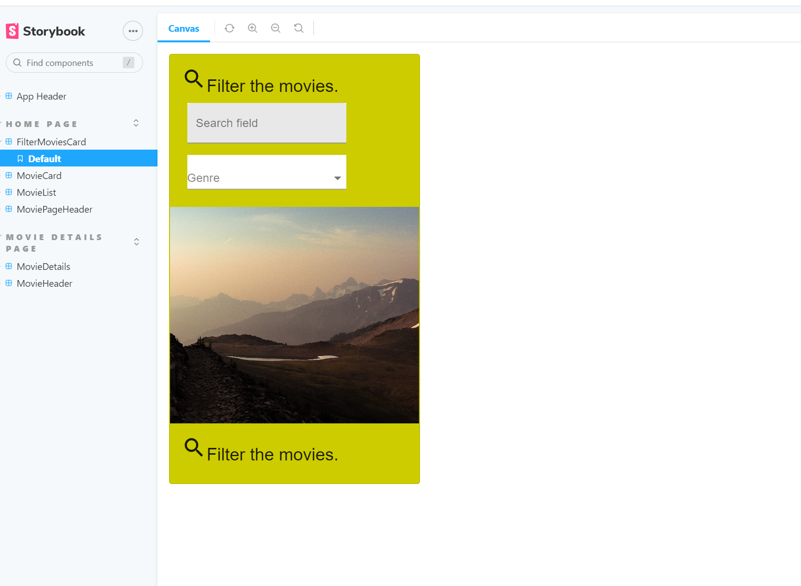
### UI Design.

[ Insert screenshots of the __new/modified app pages__ you developed (and modified existing pages), Include an appropriate caption for each one (see example below).

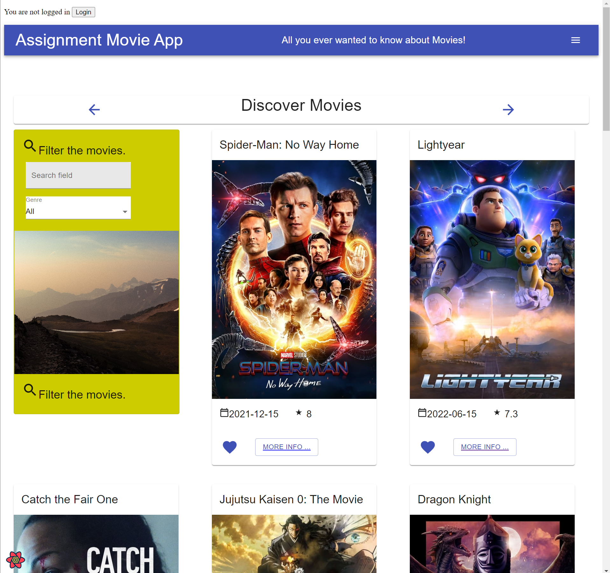

>Shows detailed information on a movie. Clicking the 'Reviews' floating action button will display extracts from critic reviews.

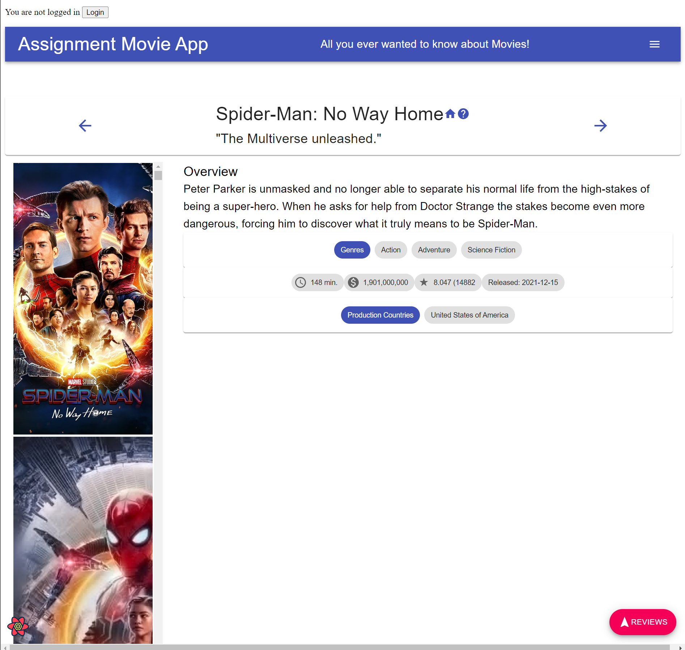

>Shows detailed information on a movie. Clicking the 'Reviews' floating action button will display extracts from critic reviews.
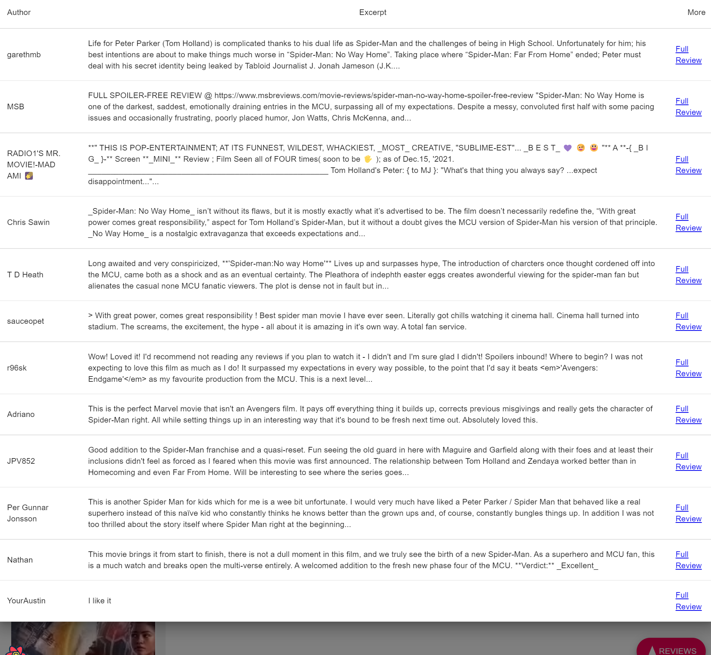
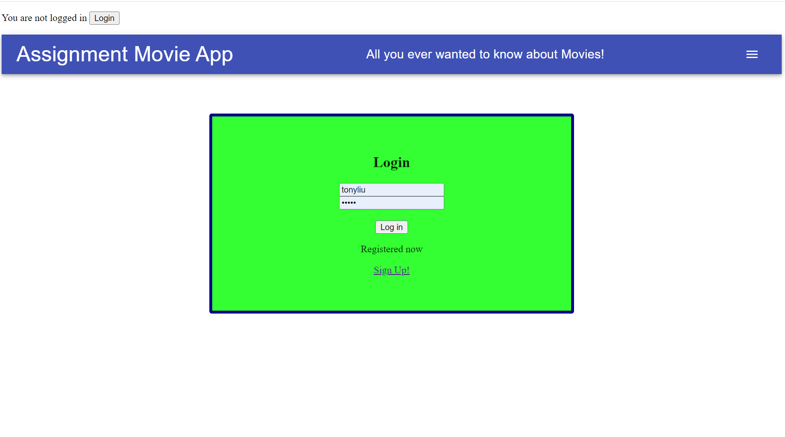
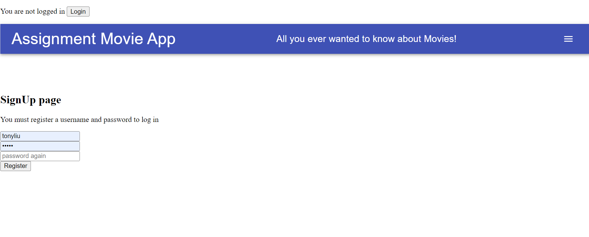
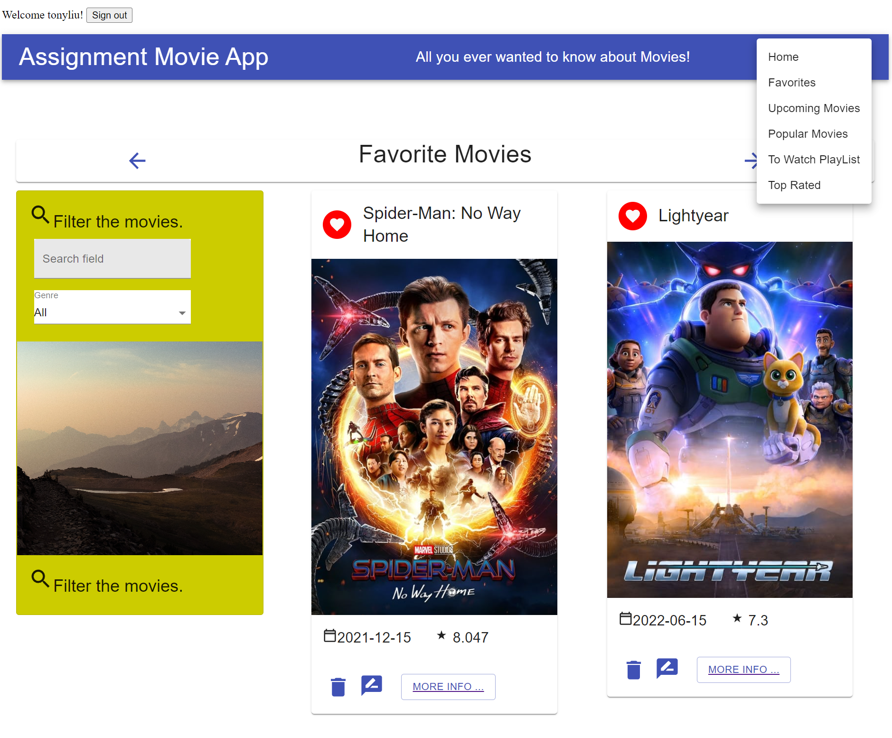
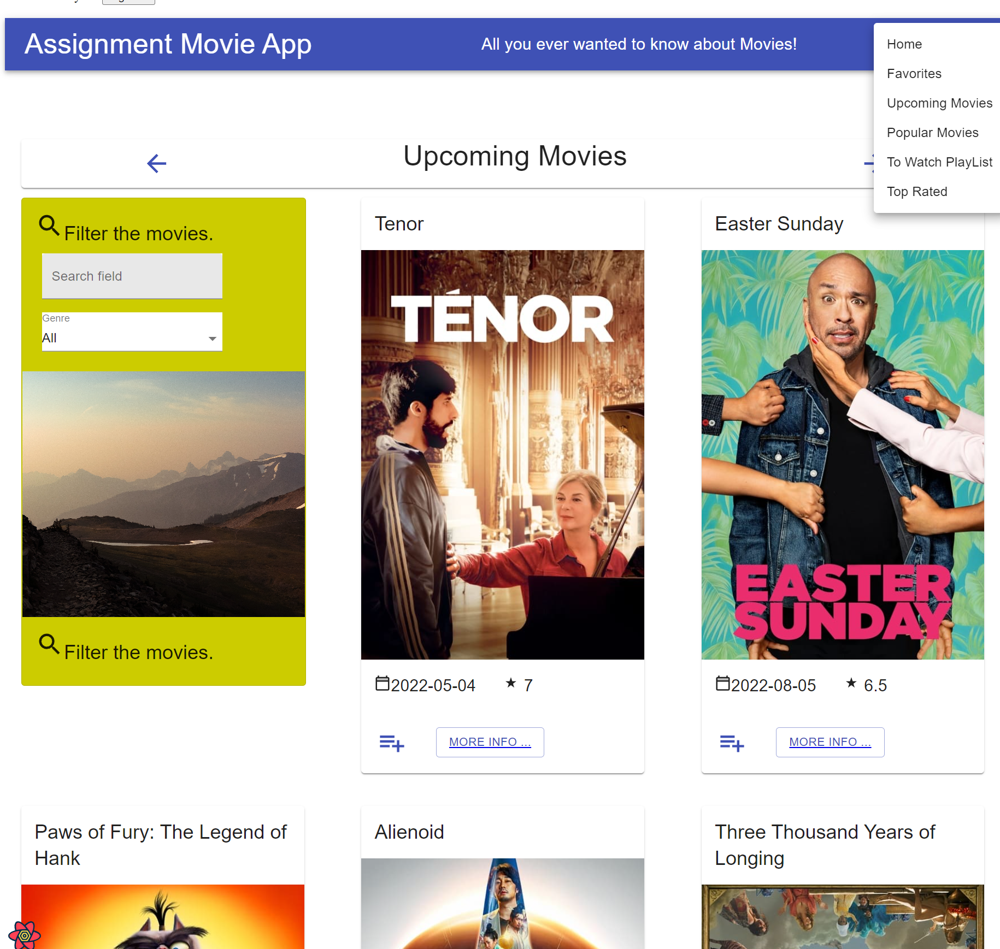
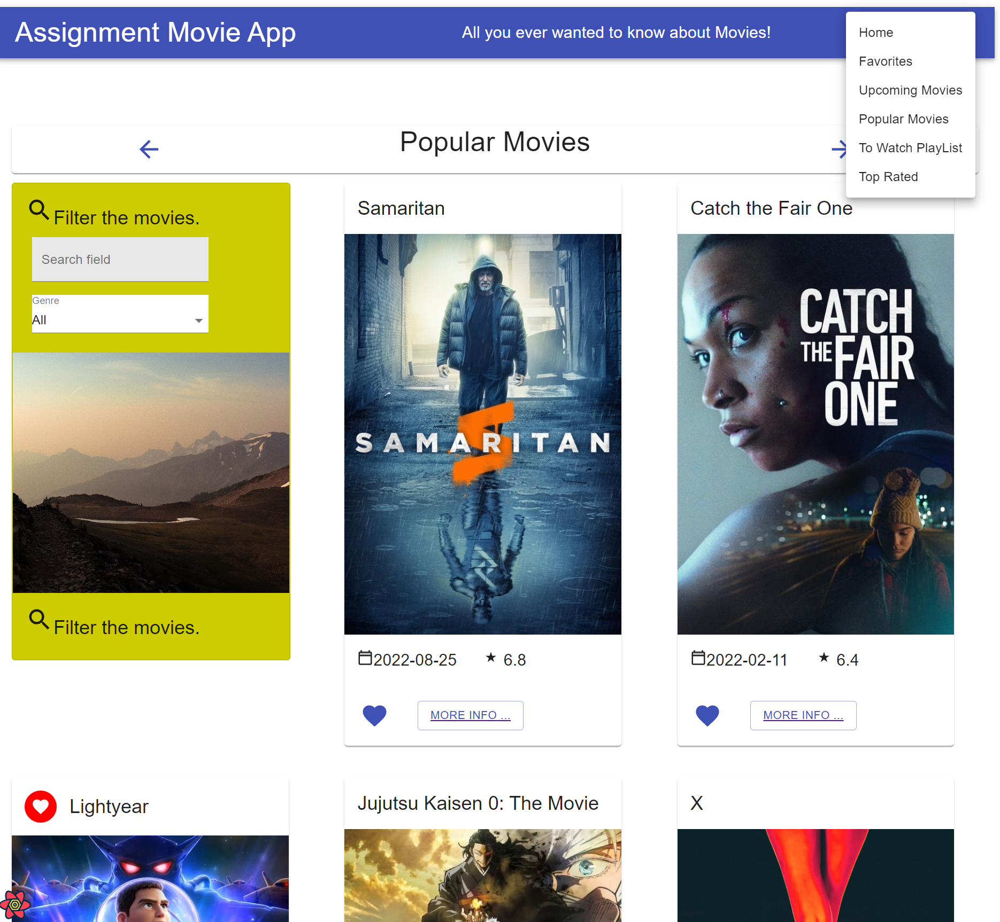
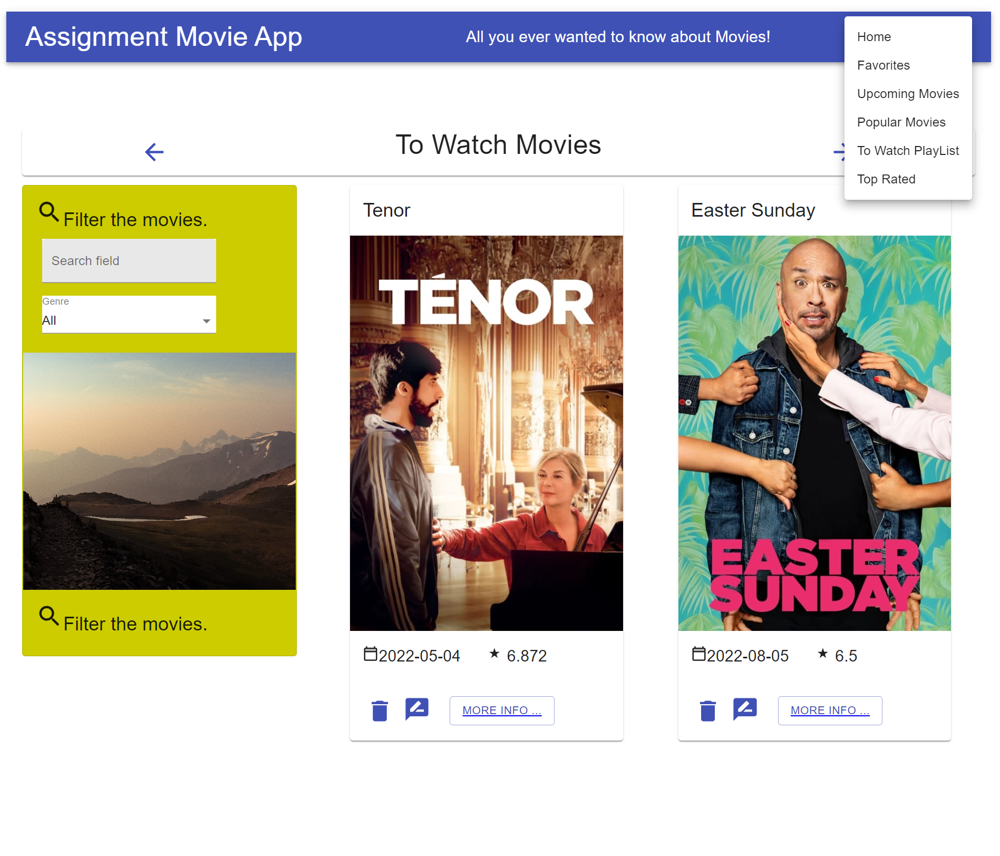
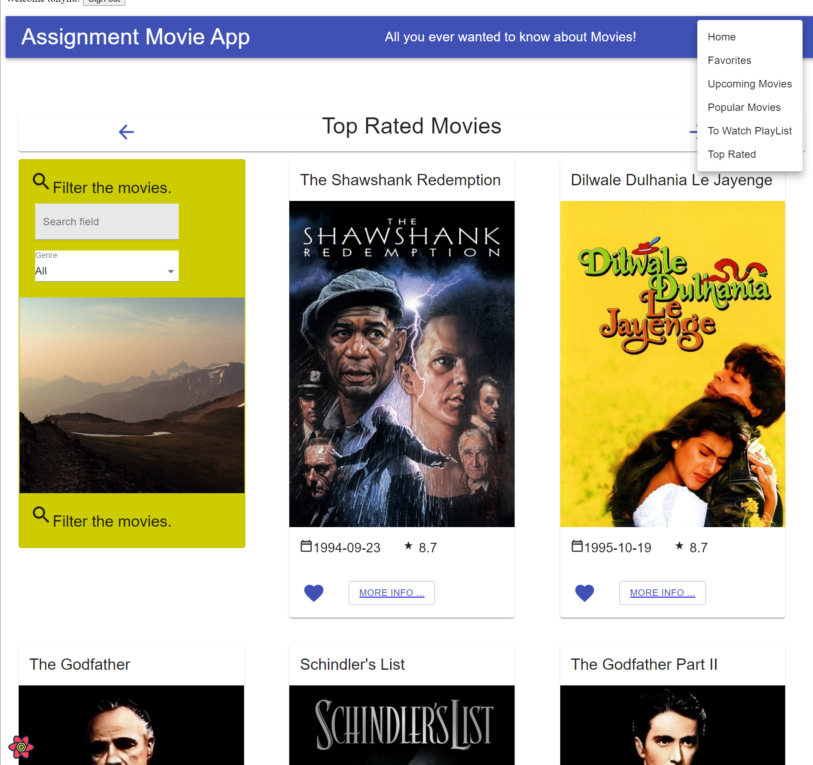
### Routing.

[ List the __new routes__ supported by your app and state the associated page.]

+ UpComing  /movies/upcoming
+ Popular movies  /movies/popular
+ TopRatedMovies - /movies/topRatedMovies
+ toWatch /movies/playList
+ SignUp /signup
+ LogIn   /login

[If relevant, state what aspects of your app are protected (i.e. require authentication) and what is public.]

## Independent learning (If relevant).

[ Itemize the technologies/techniques you researched independently and adopted in your project, i.e. aspects not covered in the lectures/labs. Include the source code filenames that illustrate these (we do not require code excerpts) and provide references to the online resources that helped you (articles/blogs).
